# CI/CD Pipeline — Configuration Project

> **Note:** this repo just explains the pipeline logic and features. If you want to simply setup the application go to [DEVOPS_WORKFLOW_MICROSERVICES](https://github.com/StealLine/DEVOPS_WORKFLOW_MICROSERVICES)

---

## What is this

GitLab CI/CD config for [Voki Application](https://github.com/StealLine/Voki_App_Project)  a microservice platform built from a React frontend and a bunch of .NET backend services.

The pipeline automates everything: secret scanning, static analysis, building, containerization, staged deployment and rollback.

More about Voki architecture → [Voki repository](https://github.com/StealLine/Voki_App_Project).

---

## Repository Structure

```text
.gitlab-ci.yml          ← entry point, includes all sub-configs
.ci/
  templates.yml         ← reusable script fragments
  jobs/
    build.yml           ← build stage jobs
    docker.yml          ← docker image build & push
    test.yml            ← security scanning + code quality
    deploy.yml          ← deploy, rollback, image initialization
```

The root `.gitlab-ci.yml` is intentionally minimal only stages global variables and workflow rules. All actual logic lives under `.ci/`.

---

## Pipeline Stages

| Stage | Purpose |
|---|---|
| `pre_detect` | Secret scanning (Gitleaks) + container vulnerability scanning (Trivy) |
| `images_init` | Manually pull and cache a new .NET base image into GitLab registry |
| `build` | Build the .NET backend and React frontend |
| `test` | SonarQube static analysis (MR and `main` branch variants, disabled by default) |
| `build_docker` | Build Docker images and push to GitLab Container Registry |
| `preview` | Deploy isolated preview environments for feature branches |
| `production` | Deploy to production, promote stable tags or rollback |

---

## About `init_image` Job

The pipeline uses GitLab Dependency Proxy for image caching. Problem: official .NET images are hosted outside Docker Hub  and Dependency Proxy can only pull from there.

Simple fix  `init_image` manually pulls the required .NET image and pushes it into GitLab Container Registry. All other jobs grab it from there after that.

---

# Key Features

### 1 — Service Detection from Branch Name

The pipeline is built for microservice architecture. You can build and deploy:

- a single specific service
- or the entire stack at once

If a single service is selected  only that service gets built pushed and deployed. All other services reuse the latest `main` images from registry.

`.tpl_extract_service` handles this  it extracts the service name from the branch name and analyzes the merge commit message to figure out how production deployment should behave.

`There is a set of rules on how to name branches merge requests etc — will be explained in details later.`

**Example**  MR to rebuild only the auth service:

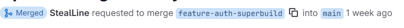

As you can see below — only Auth Service was built:

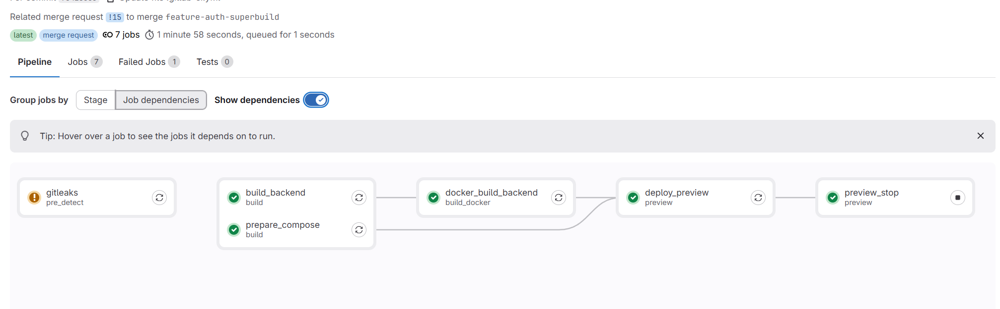

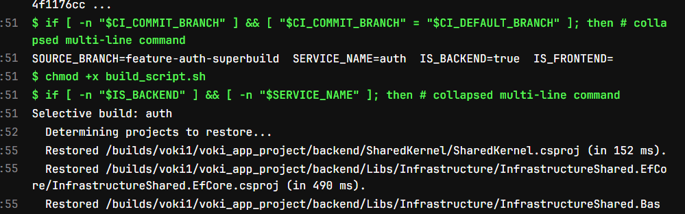

A full build on the other hand deploys every .NET microservice together with the frontend:

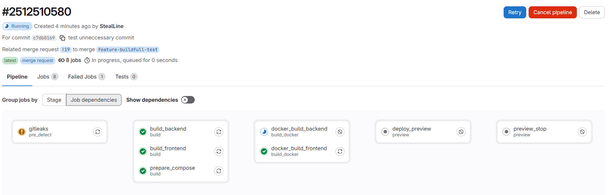

---

### 2 — Targeted Single-Service Deployment

When a single-service deployment is detected — both preview and production update **only the modified service image tag**. Everything else keeps running its current version.

For production the pipeline reads `current_tags.env` directly from the [application server](https://github.com/StealLine/DEVOPS_WORKFLOW_MICROSERVICES#application-server-setup) to know which tags are currently active.

`.tpl_resolve_tags_production` handles this:

- full build → tag resolution step is skipped
- single service → pipeline downloads existing `current_tags.env`, updates only the changed tag, leaves the rest untouched

Example of `current_tags.env`:

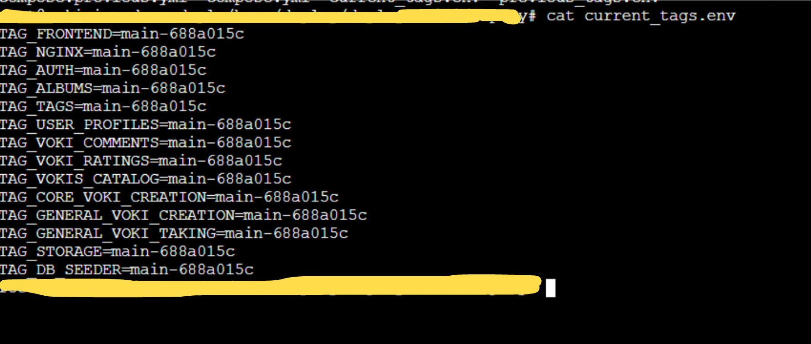

---

### 3 — Two Isolated Environments

#### Preview

Automatically created for every merge request.

Each preview deployment gets:

- its own isolated Docker Compose stack
- a unique subdomain `<short-sha>.<domain>`
- a freshly generated JWT key pair
- HTTP Basic Auth protection

Preview identifier uses `CI_COMMIT_SHORT_SHA` — same approach as in the [previous project](https://github.com/StealLine/GITLAB-CI-PROJECT). Easy to customize if needed.

Each preview also has its own MinIO S3 instance — lives only while the environment is alive gets destroyed with it.

MinIO console accessible at:

```
<short-sha>.<domain>/minio-console
```

Preview environments auto-stop after 30 days or can be manually destroyed via the `preview_stop` job.

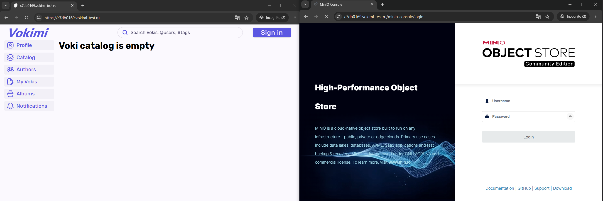

---

#### Production

Triggered automatically on every push to `main`.

Production uses:

- externally managed JWT keys stored as Base64-encoded CI variables
- real infrastructure credentials
- a dedicated `production` resource group with `oldest_first` execution order to guarantee serialized deployments

More about Docker Compose files and app structure → [Voki Application repository](https://github.com/StealLine/Voki_App_Project).

Most deployment logic lives in `deploy.yml`.

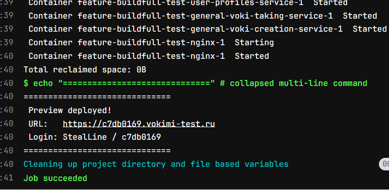

---

### 4 — One-Click Rollback

The `rollback_main` job restores the previous production state in a single step.

What it does:

1. Replaces `compose.yml` with `compose.previous.yml`
2. Replaces `current_tags.env` with `previous_tags.env`
3. Runs:

```bash
docker compose pull
docker compose up -d
```

Manual confirmation required before execution — prevents accidental rollbacks.

Before overwriting the current state the pipeline creates an extra backup of the active config just in case.

`This is a self-designed implementation and requires following specific operational rules to avoid breaking rollback logic. Limitations and rules will be described later.`

`.tpl_deploy_compose_rollback` handles the rollback

---

### 5 — Stable Image Tag Promotion

After a successful production deploy `tag_stable_images` promotes every changed service image from its commit-SHA tag to `main-stable`. The previous `main-stable` rotates to `main-previous-stable`.

This lets preview environments pull the latest stable images from current production — and gives better overall visibility.

Your registry will look like this:

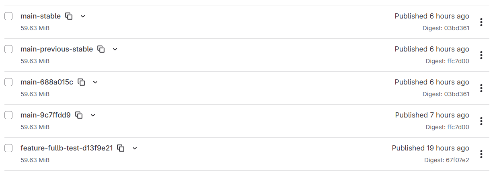

There will always be a `main-stable` tag and a `main-(some-hash)` tag pointing to the same commit. You can protect `main-` tags from deletion in GitLab with a simple regex `main-.*`.

---

### 6 — Security Scanning in Every Pipeline

**Gitleaks** — scans last 100 commits for accidentally committed secrets. Outputs a SARIF report surfaced natively in GitLab's Security tab. *(can be removed if you have limited runner usage — not required for the build and deploy to work)*

**Trivy** — scans registry images on a schedule once a day can be modified to your preferences. *(can be removed aswell)*

**SonarQube** — two job variants: pull-request analysis and main branch analysis. Disabled by default. If you have a SonarQube server set up in [Tools Server](https://github.com/StealLine/DEVOPS_WORKFLOW_MICROSERVICES#tools-server-setup) you can enable it.

All of this is in `test.yml`. You can add unit tests integration testing or anything else there.

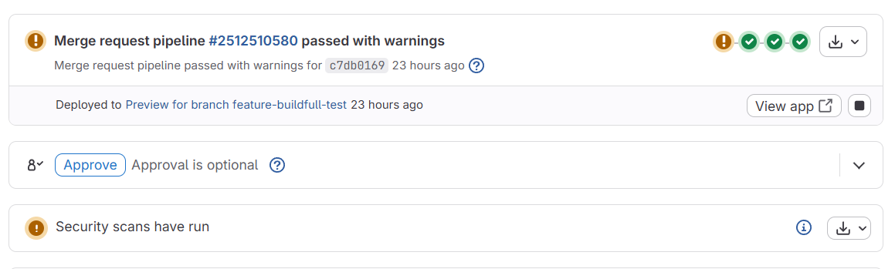

---

### 7 — Dependency Proxy and Layer Caching

All base images are pulled through GitLab Dependency Proxy (`$CI_DEPENDENCY_PROXY_DIRECT_GROUP_IMAGE_PREFIX`) — less risk of hitting external registry rate limits and generally safer and faster.

If you want you can just pull directly from the required registry — Dependency Proxy takes extra storage in GitLab.

There are also separate jobs depending on whether you use GitLab shared runners or your own self-hosted ones. If you plan on self-hosting — comment or uncomment the relevant jobs in `docker.yml` and `deploy.yml`. Self-hosted runners must be docker type.


## Services

The pipeline covers 14 services across the Vokimi platform:

**Backend (.NET):** `auth` `albums` `tags` `user-profiles` `voki-comments` `voki-ratings` `vokis-catalog` `core-voki-creation` `general-voki-creation` `general-voki-taking` `storage` `db-seeder`

**Frontend:** `frontend` (React) `nginx` (reverse proxy)


## Rules You Have To Follow For CI/CD To Work Correctly

Pipeline logic depends pretty heavily on branch naming and merge flow so if these rules are ignored some deploy stages may behave weird or rollback chain may break.

---

### Every Update Should Go Through Merge Request

Direct pushes into `main` are not expected and generally should be avoided.

Normal flow should always look like:

```text
feature branch -> merge request -> main
```

---

### Branch Naming Rules

Branch name format for single service deployments (names of the services listed above):

```text
feature-{servicename}-{anything}
```

Examples:

```text
feature-auth-fixjwt
feature-storage-minioupdate
feature-tags-refactor
```

For a full rebuild of the entire application stack:

```text
feature-{anything}-{anything}
```

Examples:

```text
feature-full-release
feature-major-update
```

---

### Avoid Special Characters In Branch Names

Branch names should not contain spaces, dots, special characters, or non-ASCII letters. Regex-based service detection depends on clean naming.

Bad examples:

```text
feature/auth fix
feature.auth.test
feature-dsdsds-dsds dsdsd qweq
feature-dsdsds-fff-sss
```

---

### Never Edit The Merge Commit Message

When merging into `main`, never edit the default GitLab merge commit message.

The pipeline parses it to determine what service changed, whether the deploy is full or partial, and how the rollback should behave. Changing it can break deployment logic.

The default message should look like this:

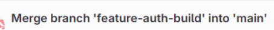

---

### Rollbacks

Rollback goes only **one step back** — there is no second level of history.

**Always trigger rollback from the latest pipeline.** If a newer deployment already exists, the rollback button in an older pipeline will fail with an error — this is enforced by comparing `deployed_sha` on the [application server](https://github.com/StealLine/DEVOPS_WORKFLOW_MICROSERVICES#application-server-setup) against the pipeline's commit SHA. Even so, make it a habit: never click rollback on a pipeline that is not the most recent one.

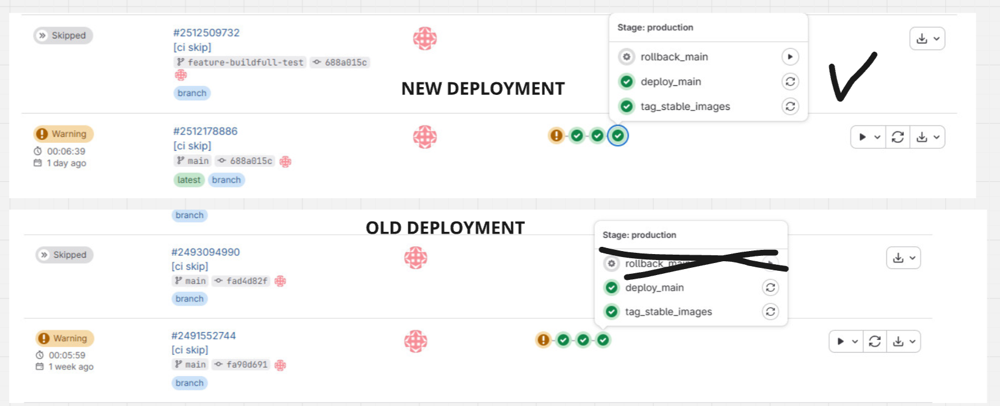